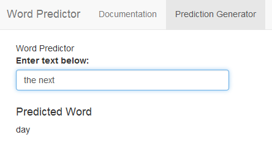

Data Science Capstone Presentation
========================================================
author: Brian Monedero Linn
date: 06/01/2017
transition: linear
css: custom.css
width: 1920
height: 1080
font-family: 'Gill Sans'

Objective
========================================================
transition: rotate
The Data Science Capstone allows the student to highlight the skills developed
in the previous courses. Requiring students to lean on skills from the R Programming 
course through the final course - Developing Data Products, the capstone represents
a great achievement. 

The objective of the capstone was to build an application, accessible through
the web, that will predict the next word in a user entered sentence. This required the
creation of a prediction algorithm, and creating an application in Shiny that could
accurately call the function and display the resulting prediction. Finally, this 
presentation represents the final element of the capstone - a data product.

Shiny Application
========================================================
transition: rotate
The application developed for this project is called ~~Word Predictor~~.

The application includes:

- Documentation describing the function and use of the predictor
- The word predictor

The Word Predictor
========================================================
transition: fade
The word predictor allows the user to enter text into a text box, and then a likely
next word is displayed below the entry.

***

The Word Prediction Algorithm
========================================================
transition: fade
The algorithm started with the input of text from news, blogs, and tweets. The text
was cleaned, and tokenized for intital analysis. Once the initial analysis was complete,
the documents were turned into a corpus that was tokenized into n-grams from, bigrams through
quadgrams. The n-gram data is then sorted by frequency and used in the prediction function
to return the appropriate word on the screen.

Accessing the Application
========================================================
transition: zoom
The application can be found at the following:
[Capstone - Course Project](https://blinn.shinyapps.io/WordPredictor/)

The link will direct the user to the Documentation tab which contains some information
about the application and how to use it. To use the predictor, switch to the Word Predictor
tab, and enter some text - the prediction will show up automatically if the predictor
is successfull. The application only works with English words.
